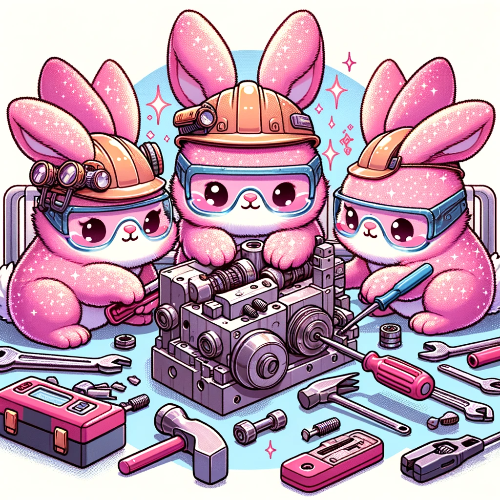

# Bunnies do work for me  

  

## Install Aider from git
`python -m pip install git+https://github.com/paul-gauthier/aider.git`

## Use GPT to improve Crew `yaml`

Feed the YAML `agents.yaml` to GPT and prompt it for better definitions for team consistency, tools and more.